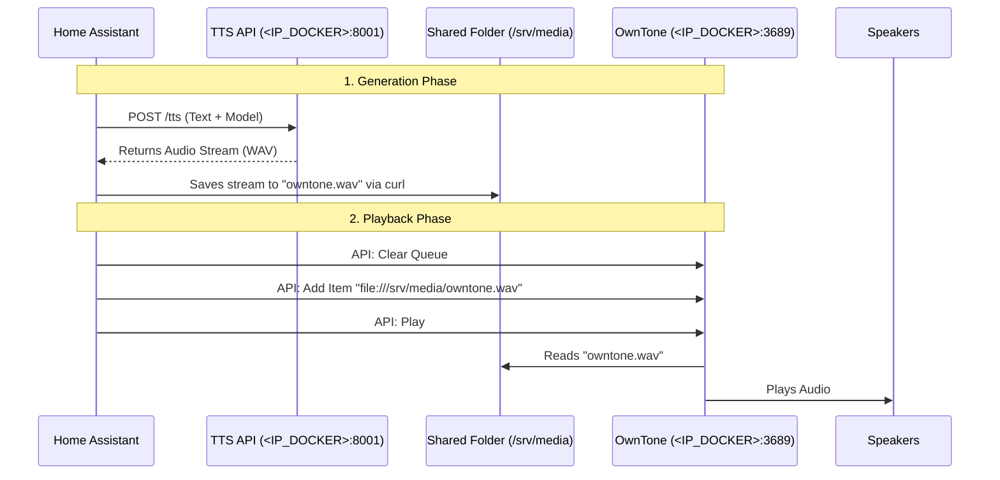

## 4. Advanced: Manual Configuration (Node-RED Style) - Direct File Save

 This method saves the audio file directly to the OwnTone `tts` folder so OwnTone plays it as a **local file**.

### Architecture Diagram



### Prerequisites (Critical)
1.  **Shared Volume**: Your Home Assistant container **MUST** have access to the `tts-server/owntone/tts` folder.
    -   You need to map the folder (e.g., `- /path/to/tts-server/owntone/tts:/media/tts`) in your Home Assistant `docker-compose.yml`.
    -   Verify that HASS can write to this folder.

### A. Define the Shell Command (Download to Shared Folder)

Update your `configuration.yaml`. This command downloads the WAV from the API (at `<IP_DOCKER>`) and saves it directly to the folder OwnTone watches.

*Change `/config/tts/` to the path where you mounted the folder inside Home Assistant.*

```yaml
shell_command:
  tts_download_to_server: >-
    curl -s -X POST 
    -H "Content-Type: application/json" 
    -d '{"text": "{{ text }}", "model_name": "{{ model_name }}", "speed": {{ speed | int(1) }}}' 
    "http://<IP_DOCKER>:8001/tts" 
    --output "/config/tts/{{ filename }}"

rest_command:
  owntone_clear:
    url: "http://<IP_DOCKER>:3689/api/queue/clear"
    method: PUT
  
  owntone_add_item:
    # Use 'file://' URI to play the local file inside the OwnTone container
    # We pass {{ filename }} variable here
    url: "http://<IP_DOCKER>:3689/api/queue/items/add?uri=file:///srv/media/{{ filename }}"
    method: POST
    
  owntone_play:
    url: "http://<IP_DOCKER>:3689/api/player/play"
    method: PUT

script:
  tts_direct_save:
    alias: "TTS: Direct Save & Play"
    fields:
      text:
        description: "Text to speak"
        example: "Xin chào"
      model_name:
        description: "Model name"
        default: "vietthao3886"
      speed:
        description: "Speed"
        default: 1
      filename:
        description: "Filename to save (e.g., alert.wav)"
        default: "owntone.wav"
    sequence:
      # 1. Download WAV directly to the shared media folder with specific filename
      - action: shell_command.tts_download_to_server
        data:
          text: "{{ text }}"
          model_name: "{{ model_name }}"
          speed: "{{ speed }}"
          filename: "{{ filename }}"
      
      # 2. Wait for file write to complete
      - delay: "00:00:01"

      # 3. Queue and Play
      - action: rest_command.owntone_clear
      - action: rest_command.owntone_add_item
        data:
          filename: "{{ filename }}"
      - action: rest_command.owntone_play
```

### D. Troubleshooting

-   **Debug Command for TTS API**: If you are unsure what the API is returning or getting 422 errors, run this command on your terminal to test:
    ```bash
    curl -v -X POST -H "Content-Type: application/json" -d '{"text": "xin chao", "model_name": "vietthao3886", "speed": 1}' http://<IP_DOCKER>:8001/tts --output test.wav
    ```
    (Check the content of `test.wav`. If it plays, the API handles binary response correctly. If it's text, you need to adjust processing.)

-   **Test OwnTone Control (Manual CURL)**:
    Assuming you have a file `owntone.wav` in the shared folder (`owntone/tts`), you can test the playback sequence manually:

    1.  **Clear Queue**:
        ```bash
        curl -v -X PUT "http://<IP_DOCKER>:3689/api/queue/clear"
        ```
    2.  **Add Item** (Force local file playback):
        ```bash
        curl -v -X POST "http://<IP_DOCKER>:3689/api/queue/items/add?uri=file:///srv/media/owntone.wav"
        ```
    3.  **Play**:
        ```bash
        curl -v -X PUT "http://<IP_DOCKER>:3689/api/player/play"
        ```

-   **Problem: No Error but File Not Saved**:
    If Home Assistant says "Success" but no file appears:
    1.  **Check Path**: Does the folder `/config/tts` exist inside your Home Assistant container?
        -   If you mapped `- ...:/media/tts`, you MUST use `/media/tts` in the shell_command.
        -   If you mapped `- ...:/config/tts`, you MUST use `/config/tts`.
    2.  **Test from HASS**:
        Go to **Developer Tools > YAML > Shell Command** (or run in HASS terminal):
        ```bash
        curl -v "http://<IP_DOCKER>:8001/health"
        ```
        If this fails, HASS cannot see the TTS server (Network issue).
